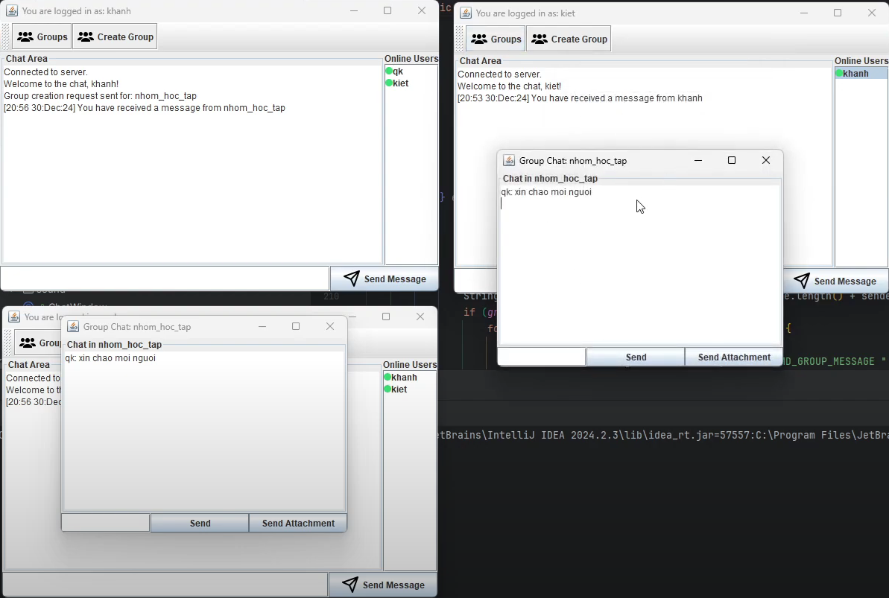

# Chat App

## Giới thiệu

**Chat App** là ứng dụng chat client-server sử dụng Java Swing cho giao diện đồ họa, hỗ trợ chat cá nhân, chat nhóm, gửi file, đăng ký/đăng nhập tài khoản với lưu trữ thông tin người dùng qua MySQL.

## Tính năng

- Đăng ký, đăng nhập tài khoản
- Chat cá nhân, chat nhóm
- Gửi file đính kèm (cá nhân & nhóm)
- Lưu lịch sử chat
- Thu hồi tin nhắn đã gửi
- Giao diện trực quan, dễ sử dụng

## Công nghệ sử dụng

- Java (Swing, Socket, JDBC)
- MySQL (lưu trữ tài khoản)
- JDBC MySQL Connector

## Cấu trúc thư mục

```
chat-app/
│
├── db script/                # Script tạo database, bảng user
│   └── script.txt
├── lib/                      # Thư viện JDBC
│   └── mysql-connector-j-9.1.0.jar
├── src/
│   ├── client/               # Mã nguồn client
│   │   ├── authen/           # Đăng nhập, đăng ký
│   │   ├── db/               # Kết nối database
│   │   ├── image/            # Icon giao diện
│   │   ├── sound/            # Âm thanh thông báo
│   │   ├── ChatWindow.java   # Giao diện chat
│   │   ├── Client.java       # Xử lý client
│   │   └── ClientGUI.java    # Giao diện chính client
│   ├── server/               # Mã nguồn server
│   │   ├── Server.java
│   │   └── ServerGUI.java
│   └── chatGroup_logs/       # Lưu lịch sử chat nhóm
│
└── README.md
```

## Hướng dẫn cài đặt

1. **Cài đặt MySQL** và tạo database:
   - Chạy file `db script/script.txt` để tạo database `db_chatapp` và bảng `user`.
   - Tài khoản mặc định: username: `root`, password: `root` (có thể chỉnh trong `src/client/db/DatabaseConnection.java`).

2. **Thêm thư viện JDBC**:
   - Đảm bảo file `lib/mysql-connector-j-9.1.0.jar` đã được add vào classpath của project.

3. **Build & chạy server**:
   - Chạy `src/server/Server.java` để khởi động server.
   - Nhập port và nhấn Start.

4. **Build & chạy client**:
   - Chạy `src/client/Client.java`.
   - Đăng ký tài khoản mới hoặc đăng nhập.
   - Kết nối tới IP và port của server.

## Hướng dẫn sử dụng

- Đăng ký tài khoản mới qua giao diện Register.
- Đăng nhập, chọn người dùng hoặc nhóm để chat.
- Gửi tin nhắn, gửi file, thu hồi tin nhắn (chuột phải vào tin nhắn).
- Lịch sử chat được lưu lại.

## Hình ảnh minh họa

### Màn hình đăng nhập


### Giao diện chat cá nhân


### Giao diện chat theo nhóm



## Video demo

Bạn có thể xem video demo ứng dụng tại đây:

[](https://www.youtube.com/watch?v=se2Z_JbxLDs)

